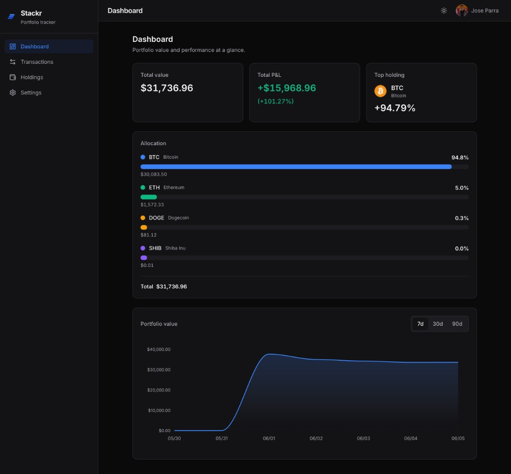
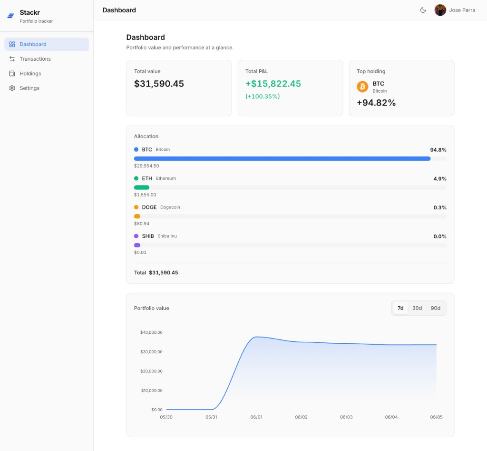
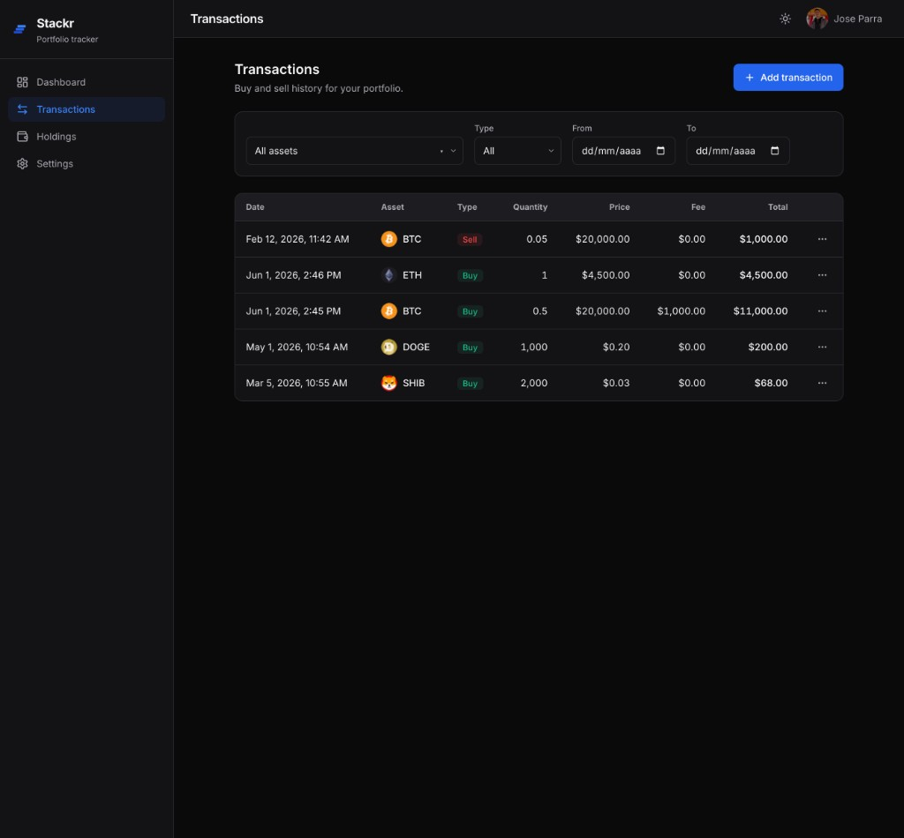
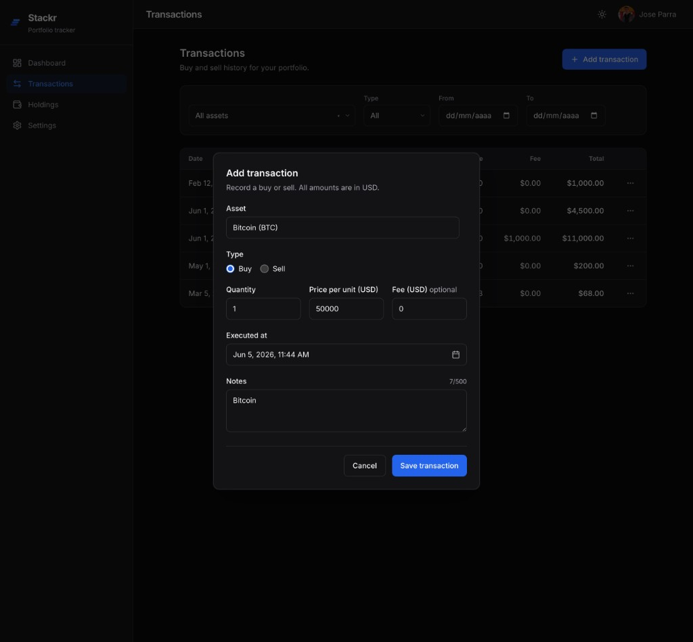
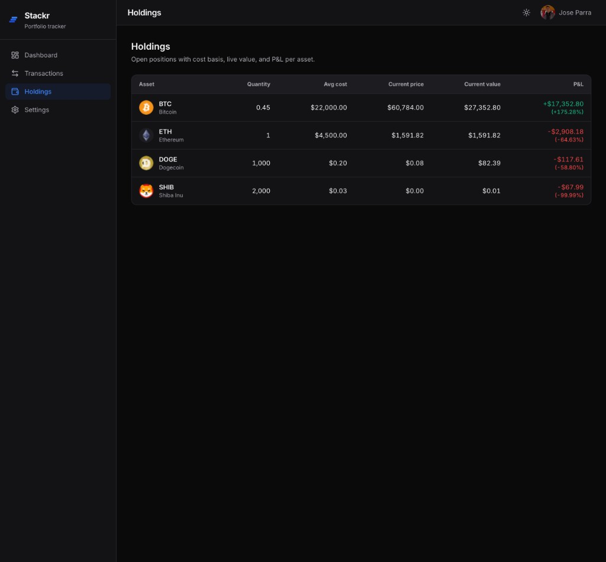

# Stackr

Crypto portfolio tracker for investors who log trades manually. Sign in, record buy/sell transactions, and see total value, P&L, allocation breakdown, and 90-day history — without connecting wallets or sharing private keys.

**[→ stackr.joseparra.dev](https://stackr.joseparra.dev)** · Angular 21 · Supabase · Tailwind v4


> Measured on the authenticated dashboard, Slow 4G throttling, incognito. CLS 0.002 · TBT 30 ms.

<table>
  <tr>
    <td></td>
    <td></td>
  </tr>
</table>

---

## Engineering notes

These are the decisions that shaped the codebase — not feature descriptions.

**Holdings as pure derived state.** `HoldingsStore` stores nothing. It's a `computed()` over `TransactionsStore` × `PricesStore`: when a CoinGecko price update arrives, Angular's signal graph re-evaluates only the components consuming that asset. No subscriptions, no manual diffing, no NgRx. → [ADR 0002](docs/adr/0002-why-signals-not-ngrx.md)

**P&L via weighted average cost.** `calculateHoldings()` is a pure function that runs in-browser on every price tick. Weighted average was a deliberate choice over FIFO: this tool isn't tax software, and lot tracking would add complexity with no user value in v1. The function has 100% unit test coverage — wrong P&L math silently harms users. → [ADR 0006](docs/adr/0006-pnl-calculation-strategy.md)

**Zoneless Angular 21.** Removing `zone.js` exposed a Supabase Auth edge case: the SDK uses `navigator.locks` by default, and `zone.js` patches native `Promise` in a way that causes `NavigatorLockAcquireTimeoutError` in HMR. Fix was switching the client to `processLock`. The broader benefit: change detection is now entirely signal-driven, no monkey-patching involved.

**Performance on an authenticated SPA.** Initial bundle is ~659 kB raw (170 kB transferred). The floor is Angular + Supabase client + Sentry handler + eager `en.json` — not much room without architectural splits. What we did defer: all routes (lazy), Apex chart (only the `line` module loads), Sentry initialization (idle callback), and Spanish locale (lazy chunk). Lighthouse performance 86 on Slow 4G, mobile.

**Security via RLS, not frontend logic.** Data access is controlled by PostgreSQL Row-Level Security policies, not by what the Angular app does or doesn't request. Every user-data table has RLS enabled with a default deny policy. The Supabase `service_role` key never touches the client bundle. → [ADR 0001](docs/adr/0001-why-supabase.md)

---

## Stack

| Layer | Choice | Reason |
|-------|--------|--------|
| Framework | Angular 21 — standalone, signals, zoneless | signals-first architecture; no NgRx at this scale |
| Backend | Supabase — PostgreSQL + Auth + RLS | typed queries; ownership enforced at DB level, not in JS |
| Styling | Tailwind v4 | CSS variable tokens; zero runtime style injection |
| Charts | ng-apexcharts (tree-shakeable) | only the line chart module ships to the initial bundle |
| i18n | Custom signal-based | English eager, Spanish lazy chunk; no Angular i18n build steps |
| Testing | Vitest + @analogjs | faster than Jest; no `zone.js` test setup |
| Errors | Sentry (lazy init) | loaded on idle callback; source maps stripped from deploy output |
| Deploy | Vercel + GitHub Actions | preview deploy per PR; production on merge to `main` |

---

## Architecture

```
TransactionsStore ──┐
                     ├──► HoldingsStore (computed, no stored state)
PricesStore ─────────┘        └─► calculateHoldings(txns, prices) — pure fn

Auth ──► authGuard ──► Shell ──► lazy routes
                            ├── /              (Dashboard)
                            ├── /transactions  (Transaction history + CRUD)
                            ├── /holdings      (Per-asset P&L)
                            └── /settings      (Profile, theme, locale)
```

Folder-by-feature: each feature owns its page, store, service, types, and specs. Cross-cutting singletons live in `core/`. Reusable components in `shared/ui/`. → [ADR 0007](docs/adr/0007-why-folder-by-feature.md)

**Database:** 4 tables (`profiles`, `assets`, `transactions`, `price_snapshots`). Quantities use `numeric(28,12)` — never float. `CHECK` constraints enforce positive quantities and non-future dates at the DB level.

---

## Architecture decisions

| Decision | Record |
|----------|--------|
| Signals over NgRx | [ADR 0002](docs/adr/0002-why-signals-not-ngrx.md) |
| Weighted average P&L over FIFO | [ADR 0006](docs/adr/0006-pnl-calculation-strategy.md) |
| Supabase over Firebase | [ADR 0001](docs/adr/0001-why-supabase.md) |
| Folder-by-feature | [ADR 0007](docs/adr/0007-why-folder-by-feature.md) |
| Manual entry over Web3 | [ADR 0003](docs/adr/0003-why-manual-entry-not-web3.md) |
| Tailwind v4 | [ADR 0004](docs/adr/0004-why-tailwind-v4.md) |
| CoinGecko over paid feeds | [ADR 0005](docs/adr/0005-why-coingecko.md) |
| Component naming convention | [ADR 0008](docs/adr/0008-component-naming-convention.md) |

---

## Screenshots

<table>
  <tr>
    <td align="center"><b>Transaction history</b></td>
    <td align="center"><b>Add transaction</b></td>
  </tr>
  <tr>
    <td></td>
    <td></td>
  </tr>
</table>

<br />



*Holdings — cost basis, live value, and P&L per asset*

---

## Running locally

Prerequisites: Node 20+, pnpm 9+, a Supabase project with Google OAuth enabled.

```bash
git clone https://github.com/joseparra-dev/stackr.git
cd stackr
pnpm install
cp .env.example .env.local   # fill NG_APP_SUPABASE_URL, NG_APP_SUPABASE_ANON_KEY, NG_APP_COINGECKO_BASE_URL
pnpm db:push                 # apply migrations to your Supabase project
pnpm start                   # dev server at localhost:4200
```

```bash
pnpm test        # 270 unit tests (Vitest)
pnpm lint        # ESLint flat config + angular-eslint, zero warnings
pnpm type-check  # tsc --noEmit
pnpm build       # production bundle
```

---

## Testing

270 unit tests across 57 spec files. `calculateHoldings` and all P&L math are at 100% coverage — incorrect financial output is a silent user-facing bug. Stores cover happy path + error cases. Components are tested only where there's conditional logic that can't be read directly off the template.

---

## Author

**Jose Parra** — Senior Frontend Engineer  
[LinkedIn](https://linkedin.com/in/joseparra-dev) · [joseparra.dev](https://joseparra.dev)

---

MIT
